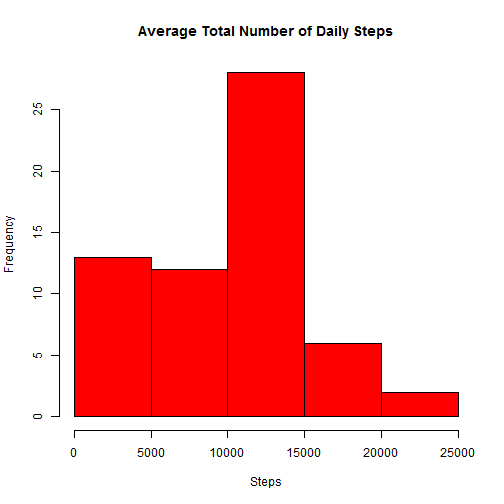
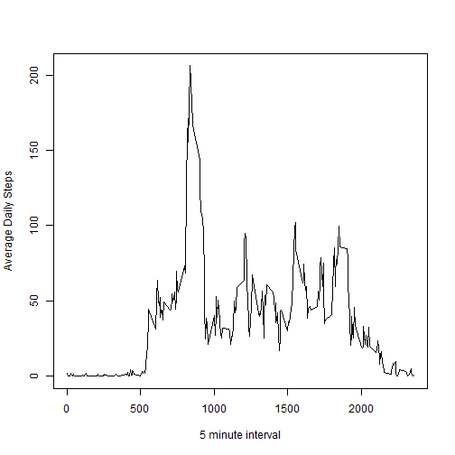

# Reproducible Research: Peer Assessment 1


## Loading and preprocessing the data

The dataset should already be present in the same repository as this report.
If you not, you can download it from the course web site https://d396qusza40orc.cloudfront.net/repdata%2Fdata%2Factivity.zip

Loads the data using read.csv

```r
data <- read.csv("activity.csv")  
summary(data)
```

```
##      steps               date          interval   
##  Min.   :  0.0   2012-10-01:  288   Min.   :   0  
##  1st Qu.:  0.0   2012-10-02:  288   1st Qu.: 589  
##  Median :  0.0   2012-10-03:  288   Median :1178  
##  Mean   : 37.4   2012-10-04:  288   Mean   :1178  
##  3rd Qu.: 12.0   2012-10-05:  288   3rd Qu.:1766  
##  Max.   :806.0   2012-10-06:  288   Max.   :2355  
##  NA's   :2304    (Other)   :15840
```


## What is mean total number of steps taken per day?
We'll first aggregate the data by date and store it in dailyAggData


```r
dailyAggData <- aggregate(data$steps, by=list(data$date), FUN=sum, na.rm=TRUE)
colnames(dailyAggData) <- c("date", "totalDailySteps")
```

Histogram:
 

The mean is 9354.2295 and the median is 10395.


## What is the average daily activity pattern?


```r
intervalAggData <- aggregate(data$steps, by=list(data$interval), FUN=mean, na.rm=TRUE)
colnames(intervalAggData) <- c("interval", "meanDailySteps")
```

plotting
 

finding which 5 min interval has max


```r
result <- intervalAggData[which.max(intervalAggData$meanDailySteps),]
```

so the interval 835 has the max avg number of steps 206.1698


## Imputing missing values


```r
missingValues <- sum(is.na(data$steps))
```
total number of rows with NA: 2304


For these missing values, we'll fill them with the daily average for that 5-minute interval calculated previously (aggData) and we'll store this in a new dataset, filledData


```r
filledData <- data
filledData[which(is.na(filledData$steps)),'steps'] <- sapply(data[which(is.na(filledData$steps)), 'interval'], function(x) intervalAggData[intervalAggData$interval==x, 'meanDailySteps'])  
summary(filledData)
```

```
##      steps               date          interval   
##  Min.   :  0.0   2012-10-01:  288   Min.   :   0  
##  1st Qu.:  0.0   2012-10-02:  288   1st Qu.: 589  
##  Median :  0.0   2012-10-03:  288   Median :1178  
##  Mean   : 37.4   2012-10-04:  288   Mean   :1178  
##  3rd Qu.: 27.0   2012-10-05:  288   3rd Qu.:1766  
##  Max.   :806.0   2012-10-06:  288   Max.   :2355  
##                  (Other)   :15840
```


 

The new mean is 1.0766 &times; 10<sup>4</sup> and the median is 1.0766 &times; 10<sup>4</sup>.


By filling the empty data, both the mean and the median moved towards the "center" of the dataset.

## Are there differences in activity patterns between weekdays and weekends?
To compare the activty patterns on weekdays vs weekends, we'll first add a new column "weedayOrWeekend" to filledData

```r
filledData$weekdayOrWeekend <- sapply(filledData$date, function (x) if (weekdays(strptime(x, "%Y-%m-%d")) == "Saturday" | weekdays(strptime(x, "%Y-%m-%d")) == "Sunday"){ factor("weekend") } else { factor("weekday") })
```

We'll then aggregate the data by both interval and the new computed column

```r
filledIntervalAndDayAggData <- aggregate(filledData$steps, by=list(filledData$interval, filledData$weekdayOrWeekend), FUN=mean, na.rm=TRUE)
colnames(filledIntervalAndDayAggData) <- c("Interval", "weekdayOrWeekend", "meanDailySteps")
```


```r
library(lattice)

xyplot(meanDailySteps ~ Interval | weekdayOrWeekend, data = filledIntervalAndDayAggData, layout = c(1, 2), type="l", ylab="Number of Steps")
```

 
