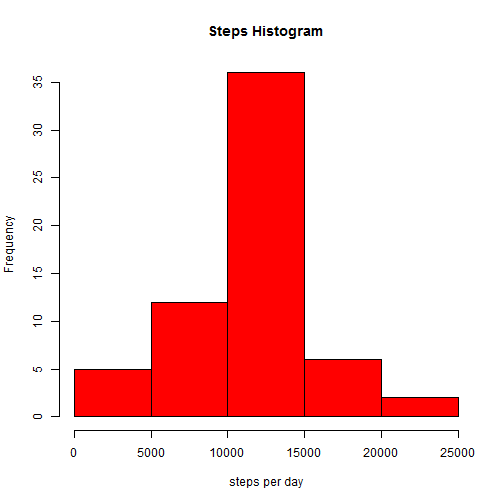

# Reproducible Research: Peer Assessment 1

This report was produced for Coursera's Reproducible Research class. Assignment 1.

## Loading and preprocessing the data

The dataset should already be present in the same repository as this report.
If you not, you can download it from the course web site https://d396qusza40orc.cloudfront.net/repdata%2Fdata%2Factivity.zip

We'll start loading the data using read.csv into the variable "data".

```r
data <- read.csv("activity.csv")  
summary(data)
```

```
##      steps               date          interval   
##  Min.   :  0.0   2012-10-01:  288   Min.   :   0  
##  1st Qu.:  0.0   2012-10-02:  288   1st Qu.: 589  
##  Median :  0.0   2012-10-03:  288   Median :1178  
##  Mean   : 37.4   2012-10-04:  288   Mean   :1178  
##  3rd Qu.: 12.0   2012-10-05:  288   3rd Qu.:1766  
##  Max.   :806.0   2012-10-06:  288   Max.   :2355  
##  NA's   :2304    (Other)   :15840
```


## What is mean total number of steps taken per day?
To find the average number of steps taken per day, We'll need to aggregate the data by date and store. We'll store this data in dailyAggData.

As seen above, the data has some missing values, so we'll remove them with na.rm=TRUE.


```r
dailyAggData <- aggregate(data$steps, by=list(data$date), FUN=sum, na.rm=TRUE)
colnames(dailyAggData) <- c("date", "totalDailySteps")  
summary(dailyAggData)
```

```
##          date    totalDailySteps
##  2012-10-01: 1   Min.   :    0  
##  2012-10-02: 1   1st Qu.: 6778  
##  2012-10-03: 1   Median :10395  
##  2012-10-04: 1   Mean   : 9354  
##  2012-10-05: 1   3rd Qu.:12811  
##  2012-10-06: 1   Max.   :21194  
##  (Other)   :55
```


 

The mean is 9354.2295 and the median is 10395 total number of steps taken in a day.


## What is the average daily activity pattern?

To find the average number of steps taken in a specific 5-minute interval, we'll aggregate the data by interval.


```r
intervalAggData <- aggregate(data$steps, by=list(data$interval), FUN=mean, na.rm=TRUE)
colnames(intervalAggData) <- c("interval", "meanDailySteps")  
summary(intervalAggData)
```

```
##     interval    meanDailySteps  
##  Min.   :   0   Min.   :  0.00  
##  1st Qu.: 589   1st Qu.:  2.49  
##  Median :1178   Median : 34.11  
##  Mean   :1178   Mean   : 37.38  
##  3rd Qu.:1766   3rd Qu.: 52.83  
##  Max.   :2355   Max.   :206.17
```


 

To find which 5-minute interval has the maximum number of steps, we'll use the which.max function on the data above (intervalAggData).


```r
result <- intervalAggData[which.max(intervalAggData$meanDailySteps),]  
result
```

```
##     interval meanDailySteps
## 104      835          206.2
```

So the interval 835 has the max avg number of steps 206.1698


## Imputing missing values
As seen above, the original dataset has some missing data.

```r
missingValues <- sum(is.na(data$steps))
```
The total number of rows with NA is: 2304


For these missing values, we'll fill them with the daily average for that 5-minute interval calculated previously (intervalAggData) and we'll store this in a new variable "filledData".


```r
filledData <- data
filledData[which(is.na(filledData$steps)),'steps'] <- sapply(data[which(is.na(filledData$steps)), 'interval'], function(x) intervalAggData[intervalAggData$interval==x, 'meanDailySteps'])  
summary(filledData)
```

```
##      steps               date          interval   
##  Min.   :  0.0   2012-10-01:  288   Min.   :   0  
##  1st Qu.:  0.0   2012-10-02:  288   1st Qu.: 589  
##  Median :  0.0   2012-10-03:  288   Median :1178  
##  Mean   : 37.4   2012-10-04:  288   Mean   :1178  
##  3rd Qu.: 27.0   2012-10-05:  288   3rd Qu.:1766  
##  Max.   :806.0   2012-10-06:  288   Max.   :2355  
##                  (Other)   :15840
```

filledData is not missing values. We'll aggregate this new data by date.

 

The new mean is 1.0766 &times; 10<sup>4</sup> and the new median is 1.0766 &times; 10<sup>4</sup> total steps taken in a day.


By filling the empty data, both the mean and the median moved towards the "center" of the dataset.

## Are there differences in activity patterns between weekdays and weekends?
To compare the activty patterns on weekdays vs weekends, we'll first add a new column "weedayOrWeekend" to filledData.

```r
filledData$weekdayOrWeekend <- sapply(filledData$date, function (x) if (weekdays(strptime(x, "%Y-%m-%d")) == "Saturday" | weekdays(strptime(x, "%Y-%m-%d")) == "Sunday"){ factor("weekend") } else { factor("weekday") })
```

We'll then aggregate the data by both interval and the new computed column.


```r
filledIntervalAndDayAggData <- aggregate(filledData$steps, by=list(filledData$interval, filledData$weekdayOrWeekend), FUN=mean, na.rm=TRUE)
colnames(filledIntervalAndDayAggData) <- c("Interval", "weekdayOrWeekend", "meanDailySteps")  
summary(filledIntervalAndDayAggData)
```

```
##     Interval    weekdayOrWeekend meanDailySteps  
##  Min.   :   0   weekday:288      Min.   :  0.00  
##  1st Qu.: 589   weekend:288      1st Qu.:  2.05  
##  Median :1178                    Median : 28.13  
##  Mean   :1178                    Mean   : 38.99  
##  3rd Qu.:1766                    3rd Qu.: 61.26  
##  Max.   :2355                    Max.   :230.38
```


```r
library(lattice)

xyplot(meanDailySteps ~ Interval | weekdayOrWeekend, data = filledIntervalAndDayAggData, layout = c(1, 2), type="l", ylab="Number of Steps")
```

 
